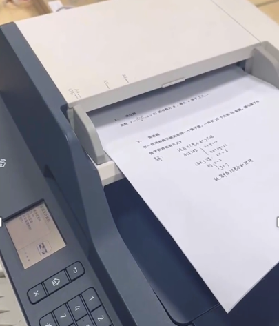

# 智能打印机:纸质作业自动批改机

🌐 [English](./EN_Readme.md) | [中文](./README.md)

## Resource

[Demo Video](https://www.bilibili.com/video/BV1yj411R7FR/?share_source=copy_web&vd_source=2402ea50d5e761d0c54f9f9cb8f35a85)
[Website](https://saomiaoshijuan.com/) 

## 引言

我们设计了一款用于批改纸质作业的机器，基于新的大模型技术和产品形式，实现了一键扫描、留痕批改和数据分析的功能。

具体来说，该系统一键扫描整份作业，并在试卷上自动打印批改结果；所有的批改结果都在云端被记录下来，可随时调用；此外，系统还具备强大的数据分析功能，能对批改结果进行统计和分析，针对学生用户提供错题本、薄弱知识点汇总等功能。该设备每分钟能批改超过60份作业，单页成本约为5分钱，批改准确率超过97%。  

与现有的基于照片的作业批改软件相比，我们的批改机创新性的采用了软硬件结合的方式，在多方面有着远超传统软件的优势：  

硬件方面，我们通过调用常规打印机接口与打印机进行通信，打印机自动批改结果，期间所有打印任务均由系统完成，整个过程无需老师手动操作，完全自动化地将批改结果打印在作业上，实现了自动化、留痕的批改，极大地减轻了用户的负担。  

软件方面，我们采用了多种方式提升了本项目的易用性：  

- 在模型选用方面，我们基于专门设计的LLM对抗交流系统，综合了RAG和MoE相关技术，大幅提升了模型判别准确率；同时辅以用户反馈，实现了准确批改；  
- 在软件方面，我们大量采用高性能开发方式，大大提升了处理速度，实现了高速、批量批改。

## 技术创新点

本项目的主要用户是
- 中小学校老师
  - 主要应用场景为平时作业批改、学校考试批改

- 中小学校同学 
  - 主要应用场景为试卷反复练习、错题本调用

本系统集成了自动试卷扫描、大模型识别与批改功能，并通过LLM（大型语言模型）优化，最终生成AI评分结果。后端使用Java，前端使用Vue.js/JavaScript，测试使用Junit和Jest。

我们使用了如下技术：
- LLM对抗交流系统
  - 单模型系统优化
    - 微调超参数
    - GPT角色设定
    - 检索增强生成（RAG）

  - 多模型系统优化
    - 多专家混合模型（MoE）
      - 多代理讨论
      - 交叉验证

  - 用户反馈
- 用户请求加速与高并发处理
  - Kafka消息队列
  - Redis缓存
  - 云服务器部署
    - 自动伸缩
    - 弹性负载均衡
    - 云监控
- 高性能数据库搜索与扩展性优化
  - Elastic Search
  - 数据库优化手段  
    - 分片机制
    - 复制 
    - 分区
    - 预写日志（WAL）
    - 自动扩展

以下将详细介绍这些技术：

### LLM对抗交流系统

为提升作业批改系统的准确性，我们针对该应用场景，即中小学作业批改，设计了一种专门的模型对抗与交流系统，该系统可以优化现有模型，使其判断速度和判断准确率提升。该系统采用了包括微调超参数、GPT角色设定、检索增强生成技术（RAG）、受多专家混合模型（MoE）启发的多代理讨论和交叉验证机制，使问题解决准确性提升了8.2%，并显著减少了模型生成幻觉现象。

#### 什么是幻觉？
在大语言模型中，“幻觉”指的是模型生成的内容与现实世界事实不符（事实性幻觉）或与用户输入的问题不相关（忠实性幻觉）。

例如，在本项目中，进行数学题判别时，模型可能在其生成结果中夹杂与题目无关或存在事实性错误的内容：
- 事实性幻觉，如生成错误的数学运算结果。
- 忠实性幻觉，如解释数学概念而不是解答题目本身。

这些幻觉掺杂在大模型生成的其他正确内容中，显著的影响了大模型的回答质量。

#### 单模型系统优化
在本项目的实际应用中，未经优化的大模型在判断的准确性方面存在局限，主要因其通用性，未针对特定学生题库进行微调。

为了优化单模型系统，我们采取了以下方法：

- 微调超参数。在为预训练大模型进行少量学习，也就是微调阶段时，我们利用网格搜索和贝叶斯优化等超参数调优技术，结合实验确定超参数（如Learning Rate、Batch Size和Regularization Parameters等等）最佳组合，以提升模型性能。  在这里举出本项目所需调节的数个超参数：
  - 学习率：用于控制参数更新的步长。学习率较低可以使模型收敛更稳定，但是需要更长的训练时间；学习率较高则反之。在本项目中，学习率的给定值一般在1e-6级别。
  - 迭代次数（Epochs）：用于控制训练数据集被完整遍历的次数。迭代次数较多可使模型学习更充分，但是次数过多会导致过拟合。在本项目中，Epochs被调节在500左右。
  - 温度值：该值用于调节最后从概率分布中选择词过程中的随机性，以控制大模型生成内容的随机性。该值较高，则新的概率分布越均匀，随机性越大，生成内容越具备创造性和多样性，但是也越容易产生一些答非所问或是错误的答案。在本项目中，为了确保生成内容不至于太过发散而导致答非所问，一般将该值设置的较小，目前我们设置为0.3。
  
  除此之外，还有很多超参数，在这里不一一叙述。为了提升本项目中大模型判断的正确率，同时保证响应速度等其他方面不至于影响大模型运用，我们需要将这些超参数进行调节与互相组合，达到整体上的最优值。  
  例如，我们提前使用一些已经确认答案的数学题进行小样本学习，此时根据结果对超参数进行微调.我们针对迭代次数进行调节，先根据贝叶斯优化等超参数调优技术找到该超参数的大致值，而后结合实验，确定该超参数的最优值，使大模型对数据集进行尽可能多的迭代次数以保证学习充分，但是又不产生过拟合；而后，调节温度值，使大模型的生成内容更具准确性。在确定了数个参数的最优值之后，我们将超参数组合起来，通过实验找到最优的超参数组合。如此反复对超参数进行调节和组合，最终让单模型在实际应用（批改大量数学题）中取得最优效果。

- GPT角色设定。通过在训练中明确指定模型的角色，例如chat、assistant或teacher，可以使模型在特定场景下更具针对性和适应性，从而提升其在特定任务中的表现。  
在本项目中，我们一般选择teacher角色，此角色相比其他角色来说更符合目标用户需求，在判断方面更具优势，可以在一定程度上提升大模型处理事实性问题的能力。  
- RAG检索增强生成技术。在模型生成内容时，如果能引入相关的背景知识，模型就能在更大程度上生成准确且相关的内容，从而降低产生幻觉的可能性。基于此，为进一步提升单模型的判断准确率，采用了该技术。该技术将知识库中的数据向量化并存储于数据库中，在用户提问时检索相关知识，并基于这些相关知识生成答案。  
在本项目中，我们准备了一个涵盖了中小学考纲内容和课程知识的专用知识库，并辅以目前已有的中小学题库，基于这些知识库生成答案，可以有效提高单一模型的决策正确率。

#### 利用多模型系统优化性能
在本项目中，尽管单一模型结合RAG技术后准确率有所上升，但仍有提升空间。前期验证结果显示，单一模型在使用RAG后，生成答案的准确率仍仅略高于80%。为进一步提升准确率，我们借鉴学生们讨论和互相校对答案的过程，引入了多模型系统的讨论机制：多个模型共同讨论并互相校对，以提高最终答案的可靠性。本技术包含以下两个关键要点：

##### 多代理讨论

本系统通过AWS云服务部署。在AWS上使用EC2实例，用于主要的应用代码部署、计算和运行服务；使用S3用于存储静态资源和数据；使用Amazon RDS用于在云端进行数据库托管，该服务接管数据库管理任务，如备份、恢复、故障检测和修复等，确保数据的高容错和灾难恢复能力；使用lambda用于无服务器计算，实现自动化任务和事件驱动的函数执行。

为了实现多代理讨论，设计如下流程：
- 请求接收：我们将本项目的主要模块部署在AWS EC2实例上，实例接收客户端请求、解析任务内容并进行相应的处理逻辑。  
- 多线程处理与请求分发：使用基于JAVA多线程技术的并行处理方法，通过开启多个线程同时向多个模型并行发送请求的方法，使多个模型同时处理相同问题，从而提高效率。  
例如，在上传了某道数学题并将数学题进行解析后，开启多个线程，每个线程对应一个独立模型对话，而后将数学题内容并行分发给多线程，即令大模型同时处理该问题。在实际使用中，假设一个大模型针对某个问题的响应时间最多5秒，若采用串行处理，则意味着逐个模型询问、等待，等待时间为所有模型的响应时间之和，远远超出可接受范围；而采用并行处理，则最多只需要等待5秒。  
完成识别后，部署在AWS EC2上的数据处理模块整合各模型的识别结果，得出更加准确和全面的结论。

在这个过程中，我们使用线程池用于线程的管理和复用，介绍如下：

在本项目中，为了实现更高的并行处理效率，采用了线程池技术。线程过多会带来调度开销的增加，进而影响缓存局部性和整体性能。为此，需要对线程的创建和销毁进行合理管理。通过事先创建一个线程池，利用池中线程来并行处理任务，并通过特定逻辑对线程进行管理和重用以提高效率。   
  在本项目中，利用Executor框架，创建固定大小的线程池，提供线程复用和线程调度功能。  

- 结果整合：AWS EC2上的数据处理模块协调来自不同模型的回答，经历交叉验证过程，最终得到一致答案。

在多代理讨论过程中，如果经过语义一致性检查、逻辑一致性分析等步骤后，各模型的处理结果一致，则判定答案正确；若结果不一致，则会进行交叉验证（将会在下文介绍）步骤进行比对和判断，以规避错误。下图展示了具体运作流程。

目前，我们使用的大模型包括语言大模型Llama-3-70b-Groq、Claude-3.5，多模态大模型GPT-4o、Gemini等。通过引入多模态大模型，我们确保了该系统可以有效处理带图题目以及画图题，同时兼具语言大模型在处理自然语言的优势。引入这些模型不仅可以结合每个模型的优势，也可以通过多代理讨论使判断结果出错的概率被降至最小。另外，未来我们还可以换用或增加能力更强的模型。

##### 交叉验证
引入RAG的主要目的是获取更多知识以生成更加准确的回答，虽然其可以在一定程度上减少幻觉，但效果仍然有限，因此我们依然需要引入新方法重点解决幻觉问题。

   幻觉在生成内容中的比例较小且具有特异性，不同模型生成的幻觉各自不同。因此，通过多模型互相比对和质询生成结果，可以有效减少幻觉。基于这一特性，我们引入交叉验证方法，以最大限度去除幻觉。此方法主要步骤如下：

- 初次生成与汇总：服务器将问题和多个模型的回答汇总，判断回答中是否存在幻觉。判断技术包括语义一致性检查、事实验证（如数值运算准确性）和逻辑一致性分析。

- 二次质询与打分：在初次汇总的基础上，服务器为每个模型分别新开一个线程，通过新线程将综合后答案发回各模型，并进行二次质询。提问包括：
   - 对这些回答进行评分。
   - 基于目前获得的所有信息，尝试生成更好的回答。

- 答案整合：根据打分和生成结果，去除可能存在幻觉的部分并替换为正确内容。如果打分结果显著偏向某一答案，则采用该答案，视为模型达成共识；若无法判断，则重复进行质询操作。

此过程最多进行三轮，以确保在较短处理时间内尽可能去除幻觉并提高准确性。

#### 用户反馈
为进一步提升最终结果判断的准确性，本项目结合了用户反馈的功能。经过单模型系统和多模型讨论后生成的最终答案会存入数据库，并标注该回答由AI生成，等待验证。若批卷老师在试卷讲解后对本答案未提出质疑，则证明该AI生成的回答是正确的，这时才将其视为正确答案并标注为正确；反之，则重新生成，甚至人工批改。

加入这一步后，我们可以保证本项目存储的批改数据均为正确数据，而即便在极少数情况下大模型系统判错，在第一位批改老师提交判错报告后也可以及时得到修正，不会误导其他老师的批改。

#### 总结
我们在单模型上微调超参数、设定GPT role，在多模型系统上采用多代理讨论，优化了批改系统的性能；针对单模型采用了RAG技术，针对多模型系统采用了交叉验证策略，最小化了幻觉现象，显著提高了AI评分系统的准确性；最终，我们还加入了用户反馈的环节，保证批改结果万无一失。在实际应用中，AI判别系统将问题解决准确性提高了8.2%，而数据库内存储批改结果因用户反馈环节的介入，更是确保100%正确率，确保了评分结果的可靠性和一致性。

### 用户请求加速与高并发处理

随着项目的展开，本系统所需要处理的数据量将会快速扩大。以数学为例，根据目前在已部署学校的统计，一个班每天会有40份左右的数学学科作业卷需要批改，一个学期大约会产生5000张卷子的批改量。若算上学校内所有班级、同一个班的多个科目，以及期中与期末考试卷，仅一所学校的总批改量就会达到相当水平，而涉及到的题目量则更为夸张。因此该应用场景相当考验数据库的调用和搜索能力。另外，老师随时可能运用本系统进行批改，同学也可能在临近期中期末的时候，大量调用曾经做过的题目进行复习，这对本项目的高并发能力也提出了要求。

出于最大程度增加本系统的速度和效率，以提升项目易用性和用户满意度的考虑，我们在搜索方面的多个阶段，运用高性能开发知识，在软件层面上分别采用了不同的加速处理方法。我们使用Kafka消息队列处理查询高峰，并利用Redis缓存存储最近查询和答案，提供快速的LLM响应；在数据库方面，我们还使用了弹性搜索技术，实现快速搜索和索引问题数据库；最后，我们还对数据库进行了一系列优化，进一步提升了数据库的易用性。

#### Kafka消息队列
考虑到项目性质，搜索请求在大部分时间并不会非常大，因为不同老师不太可能完全在同一时间使用本系统批改作业。但是在少数高峰期（如学校期末考试）时刻，短时间搜索请求可能激增。为此我们使用Kafka队列。这是一种高吞吐量的分布式消息队列，能够在试卷批改流程中发挥关键作用处理大量并发请求，在这类高峰期中可以有效平衡服务器负载。

当用户提交搜索请求时，该请求首先通过由Amazon服务提供的Amazon API Gateway，该服务用于维护和监控API并提供身份验证服务，在本项目中接收用户请求并将其转发到部署在AWS云服务上的服务器；后端服务器将请求数据格式化后，发送到Kafka队列，这一步通过异步调用实现；Kafka将请求进行分区，并分配给多个消费者节点处理，这些节点可以是分布式的计算服务。Kafka将这些试卷任务以消息的形式发布到对应的Topic中，每个批改节点作为消费者从Kafka中获取试卷进行处理。处理结果的回传同理。

在处理过程中，异步调用可以避免同步阻塞，提高了请求处理的并发能力；由于Kafka支持多消费者并行处理，系统能够实现大规模并行计算，从而显著提升批改速度；另外，在高峰期，Kafka能够均衡负载，避免了单点瓶颈，即使某个节点故障，其他节点也能继续消费剩余任务，确保系统的稳定性和高效运行。总体来看，这不仅加快了搜索请求处理速度，还确保系统在高峰期的稳定性。

除此之外，通过Kafka，我们能够实时监控每个节点的工作状态，分析任务的处理进度。另外，Kafka内建的消息备份和容错机制能够在节点宕机或网络波动时，快速恢复数据，确保试卷批改任务的连续性和完整性。

以下是Kafka队列在本项目中的实际应用案例：

   > 假设在期末考卷阅卷时间，数学教师们集中上传学生考卷进行批改，此时系统会接收到大量并发查询请求。在某一时刻，3位数学老师同时上传了200份作业进行批改，这些请求首先会通过API Gateway传到后端服务器后端服务器将这三位老师的请求进行格式化，并将其发送到Kafka消息队列。假设我们有三个处理节点，根据检测使用率、I/O流量等，可知1号处理节点负载较高。Kafka根据上述结果，将这些作业处理请求主要分发到2、3号节点，通过节点上的处理器，让每个节点相对均衡的各自负责一部分作业的批改任务，这样可以实现负载均衡，避免单一节点过载。节点处理完成后，将作业处理请求发回到kafka消息队列，而后返回到服务器端。服务器端将信息返回到前端页面，从而使教师可以看到他需要的结果。

通过这种方式，我们可以确保即使在高并发情况下，系统依然可以稳定、高效地响应每一个用户请求。目前我们的服务器能够达到500 QPS，在未来如果需求进一步增大，我们也会继续改进系统架构和扩展处理能力。

#### Redis缓存
Kafka主要解决的是高并发问题，而为了进一步提升系统的响应速度，我们引入了Redis技术。Redis是一个内存缓存系统，在这里我们采用基于容量的缓存回收策略，存储最近的查询和响应以便快速检索。

根据在已部署学校展开的使用统计，同一个年级往往使用同一套试卷用于作业和考试，因此同一学校的不同老师在批改时极可能会调用到同一题；另外，最近被调用的题目往往是新题，而这些新题相比已经被使用多次的旧题来说，更有可能在同一时间段被其他学校的老师采用；其次，因存在课程改革、教材修改的情况，且出卷一般要求不使用旧题，因此在本项目中，距离最后一次使用时间越长的数据，越不太可能被用到。基于此，我们在回收算法上，采用LRU算法以去除使用时间最久远的数据，而保留调用时间距离现在较近的数据。

接收到查询后，系统首先检查Redis缓存。如果命中缓存，则立即返回缓存的响应。这一步完全基于纯粹的单线程内存操作，因而速度非常快，相较于从数据库读取数据，响应时间显著降低。如果未找到匹配，服务器才会将查询发送到后端数据库，并将结果缓存到Redis以供将来使用。

当Kafka与Redis在系统中协同工作时，Kafka处理的是高并发的消息队列问题，而Redis则提供快速的缓存服务。当系统从Kafka队列中接收到查询请求并完成数据处理后，后端服务器会将结果存储在Redis中。这样，下一次相同的查询请求可以直接从Redis缓存中获得答案，而无需重新查询Kafka队列或数据库。

通过在模型中广泛使用这种缓存机制，我们实现了项目的高可用目标，显著减轻了后端服务器的负担，优化了系统整体性能。

#### 云服务器的部署

此外，为了进一步提高系统的可靠性和可扩展性，我们在AWS上采用了以下技术：

- 自动伸缩（Auto Scaling）：基于负载情况自动增加或减少处理节点的数量，确保在高峰期有足够的资源处理请求。
- 弹性负载均衡（Elastic Load Balancer）：分配流量到多个后端实例，提供高可用性和故障转移能力。
- 云监控（CloudWatch）：实时监控系统性能和运行状况。

### 高性能数据库搜索与伸缩性优化

在本项目中，存在用户调用历史题目查看的需求。老师往往调用的是最近批改的题目，但是本项目同时还对学生提供了历史题目查看和错题本服务，学生可能会在临考前大量查询以往做错的题目，在这种情景下数据库经常被查询。为保证用户能在最短时间内快速、精准的检索到需要的题目，数据库的快速搜索和索引能力可谓重中之重。为了特别提升数据库的索引和搜索能力，我们引入了弹性搜索技术，这是一个专用的全文搜索引擎，基于开源的lucene实现；另外，针对数据库本身，我们还通过分片、复制、分区、预写日志和自动扩展等优化项，增强了MySQL数据库的扩展性和持久性。

#### Elastic Search
如前所述，在实际应用场景中，数据库需要容纳大量的、不同学科的题目批改结果，使用一般的数据库检索方式，有以下问题：

* 效率问题 
  * 以name like为代表的一部分SQL数据库查询采用基于表扫描等效率相对索引更低的方式检索，导致搜索相对缓慢；虽然Mysql也提供索引查询方式，但是在数据量大的情况下，采用正向索引仍然略慢。鉴于本项目所需存储的数据量相当大，这在本项目的数据库中表现的尤为明显。

* 模糊查询问题  
  * 模糊查询返回大量的数据，导致用户需要花费多余的时间在搜索结果中寻找。这在本项目中尤其是个问题，因为同一类型的题目往往题干相似。

* 格式匹配问题
  * 传统的文本匹配方法可能会因格式差异而无法检索到结果。例如，数据库中存储的数学公式通常采用LaTeX格式，而检索时可能使用不同的表示方式输入公式，导致无法匹配到相应的记录。

而Elastic Search通过分布式架构和并行处理技术，有效地解决了上述问题。它采用索引命名拆分和索引多分片技术，跨索引查询可以使用直接型（直接指定索引名称）、模糊型（使用通配符进行模糊查询）和计算型（通过计算表达式指定索引），大大提升了检索到高相关内容的几率。
- 效率方面，Elastic Search才用了倒排索引的方式存储数据。相比正排索引的根据ID顺序存储到索引，倒排索引根据文档和信息的内容查找存储该关键词的文档或者信息ID，也就是建立了从关键词到文档的映射，在查找具体内容方面比起一般的正排索引还要快速，更不必说不使用索引的表扫描等。

- 模糊查询方面，Elastic Search支持多种查询方式，包括直接型（直接指定索引名称）、模糊型（使用通配符进行模糊查询）和计算型（通过计算表达式指定索引）这三种索引方式，最大化了寻找到高相关内容的几率，避免了大量杂乱信息的干扰。这种模糊搜寻同样可以用于解决公式的格式转化问题，公式的形式不需要完全一样，只要主体一致，就可以模糊搜寻找到需要的数据，这是传统全文搜索完全无法实现的。

#### 数据库优化手段
针对数据库本身，我们采用了如下方式提升数据库的可用性。

- 分片机制
   将数据分片存储在多个节点上，每个节点处理一部分查询请求，确保负载均衡和高可用性。另外，利用分片机制还可以在多个数据库实例间复制数据，增强数据可用性和灾难恢复能力。
- 复制
   利用多个节点创建多个数据库副本，提高数据的可靠性和容灾能力。
- 分区
   根据范围分区、列表分区或哈希分区等规则，将数据划分到不同物理存储区域，减少单个物理存储区域的数据量，优化了查询效率和数据管理能力。
- 预写日志（WAL）
   在事务执行过程中，所有修改首先记录在预写日志中，然后应用到数据库，确保数据一致性和持久性。
- 自动扩展
   通过监控数据库负载，系统自动增加或减少数据库实例数量，确保高负载期间有足够资源，低负载期间节约资源。

#### 总结
在本项目中，数据库的调用大致经历了如下步骤：

- 数据输入与索引  
数据库中的数据在生成或更新时，会被同步到Elastic Search进行索引。索引过程会将数据拆分成多个分片，并存储在不同的节点上，以确保高效的分布式处理。

- 查询处理  
用户提交题目的查询请求时，该请求被服务器接收，首先写入Kafka消息队列，由Kafka负责将请求进行分区，并分配给多个消费者节点处理。处理过程中，系统首先检查Redis缓存。如果缓存未命中，查询请求将被发送到Elastic Search。Elastic Search通过其高效的索引和分片机制，快速处理查询请求并返回结果。这些索引和分片机制包括：  

  - 采用高效的倒排索引数据结构存储文档内容，它允许快速查找包含特定词项的所有文档。与传统的正排索引（正向索引）相比，倒排索引能够显著提高搜索的速度和效率。

  - 采用索引分片，每个分片是一个独立的倒排索引。这种分片允许将数据分布在多个节点上进行存储和处理，从而实现水平扩展（Horizontal Scalability）。每个分片可以独立处理查询请求，这样可以分担负载，避免单点瓶颈，提高系统的并发处理能力。

  - Elastic Search还支持副本分片（Replica Shards）。副本分片是主分片的拷贝，它们存储在不同的节点上，这样，逐个节点进行索引检索时，更有可能查到相应的内容。副本分片不仅提高了数据的可靠性和可用性，还可以在查询时提供额外的并行处理能力，进一步提升查询速度。

- 结果返回与缓存  
查询结果通过Kafka队列返回，同时系统会将结果缓存到Redis，以提高下一次相同查询的响应速度。

- 数据一致性  
后端服务器确保Elastic Search索引与主数据库的一致性，所有数据读取都会记录在预写日志（WAL）中，并同步更新Elastic Search索引。

以下是数据库使用的大致示意图和结构架构图：

## 软硬件结合

本项目的创新点不仅在于软件开发中采用了大量前沿技术，还注重软硬件结合。

在使用目前市面上的常规产品，如作业帮、小猿搜题时，即便能成功识别和判断题目，用户仍需手动批改、写评语和给分，使得这些常规产品无法真正减轻教师的负担，在批改作业时，仍需耗费大量时间和精力。特别是在批量作业和考试的情况下，手动批改的工作量更加巨大，效率低下，容易出错。

为了解决这一问题，我们在软件部分定制了专门的算法，调用了常规打印机的接口和插件，使常规打印机可以自动执行留痕批改的任务。具体来说，我们调用了如下接口和插件：

- 打印机驱动接口  
用于控制打印机的基本功能，如打印、扫描、复印等。
  - 打印文档包API：提供允许应用程序访问和管理打印文档包的接口，本项目需要该接口以调起打印任务。
  - 打印后台处理程序API：提供打印后台处理程序的接口，以便云端可以管理打印机和打印作业。在本项目中，因为试卷按照顺序放入，因此需要合理安排批改结果打印顺序。
  - 网络接口：网络接口允许打印机连接到局域网，通过网络上传扫描结果并下载打印批改结果。

- 图像处理插件  
用于处理扫描的图像数据，包括图像压缩、去噪和增强等。

- 加密插件  
使用加密算法，对上传和下载的数据进行加密处理，确保数据传输的安全性。

实际产品如下图所示：

在本项目中，用户只需将需要批改的试卷放入硬件设备的纸盘中，设备即可自动完成以下任务：

- 扫描：硬件设备使用内置的高精度图像传感器对学生的纸质作业进行扫描。该传感器能够准确扫描手写文字和符号。

- 数据处理与上传：扫描结果经过图像压缩和AES加密处理后，通过设备内置的Wi-Fi通信模块上传。数据上传过程使用HTTP POST请求，并通过RESTful API接口与云端服务器交互。云端根据接收到的加密数据进行解密，并进行批改。

- 结果下载与打印：批改完成后的数据通过加密通信端口下载至本地打印系统。根据用户的选择，系统提供两种打印方式：

   - 直接在试卷上打印批改结果：设备直接在原始试卷上标注批改结果和评语。内置的位置校准模块确保打印位置准确无误。

   - 使用空白纸页打印试卷和批改结果：云端将扫描到的试卷内容和批改结果整合后，在新的空白纸页上打印。这种方式对应老师的一部分特殊要求，例如需要保留原卷等。

通过这些技术手段和专用硬件设备，我们的项目有效地减少了老师手动批改的时间和精力，真正实现了为老师减负的目标。

## 项目优势

1. 高效的批改处理：该项目引入了一套集成的自动扫描和纠错系统，因采用大量用户请求加速与高并发技术，如Redis缓存、基于JAVA多线程技术的并行处理方法等，同时通过调节超参数控制模型响应时间，最大限度的保证了速度。该系统每分钟可以处理超过100份试卷，显著加快了评分过程。与传统的人工评分方法相比，这种高效性大大减少了教师所需要的时间和精力。

2. 智能精准分析：该系统采用先进的大模型技术进行智能评分，模型不仅能完成正确率统计和分数统计，还能识别并记录具体错误。通过错误标签和位置统计，深入分析每个学生的知识漏洞，并可根据漏洞，生成详细的反馈报告，包括错误类型分布、知识点掌握情况等。该功能帮助教师更好地了解学生的学习情况，也使本项目可基于错误分析结果，提供个性化的错题本服务，帮助学生针对性地复习和提高。

3. 高准确率和低成本：在模型方面，采用专门设计的LLM对抗交流系统，综合了RAG和MoE相关技术，动态调整和优化模型参数，辅以用户反馈，使得该系统的评分准确率超过97%，且能够批改一般搜题软件无法识别的题目，如画图题、带图题等。通过结合图像识别和自然语言处理技术，解决了传统OCR和文本识别方法的局限。此外，每份试卷的处理成本仅为0.05元，具有显著的成本优势，为教育机构提供了极具性价比的解决方案。

4. 卓越的用户体验：该项目创新性的采用了软硬件结合的方式，可调用现有打印机进行批改结果留痕打印。一方面打印机自动留痕批改，教师不需要手动批改，进一步为教师减负；另一方面，系统操作简便，教师只需要放入纸盘并按下按钮，即可在短时间内得到批改完成的试卷。同时，本项目也支持定制化格式，批改格式可以根据不同学校和教师的规定进行灵活调整，在用户体验方面表现出色，得到了教师的高度认可和积极反馈。

##  项目商业化

本项目充分考虑了教育市场的需求和特点，通过To B和To C两种盈利模式，实现了多元化的收入来源。

在To B模式下，本项目的主要客户是各级教育机构和学校，提供信息化设备和智能批改系统的整体解决方案，包括硬件采购和软件部署。学校可以按需购买服务，确保持续获得最新的技术支持和维护服务。

To C模式则直接面向学生家长，提供个性化的教育服务。家长可以为孩子购买智能批改系统生成的错题本和针对性辅导材料。此外，我们还提供一系列延伸服务，如在线辅导、学习进度跟踪和个性化学习建议。

在国家对教育的投入增加和信息化进程快速推进的背景下，我国教育市场规模超过6000亿，影响4亿人，其中信息化投入占15%。这为本项目的主体，即智能批改系统和相关服务，提供了广泛的市场基础和发展潜力。

## 使用案例

### 佛山市本原小学（数学四年级）

### 杭州市文三街小学（英语三年级）

